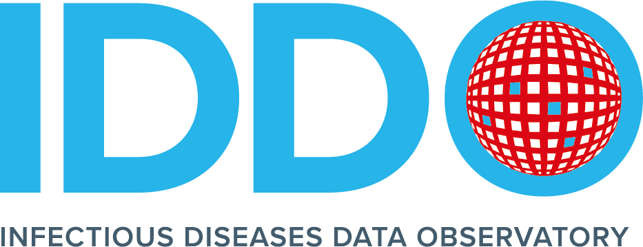
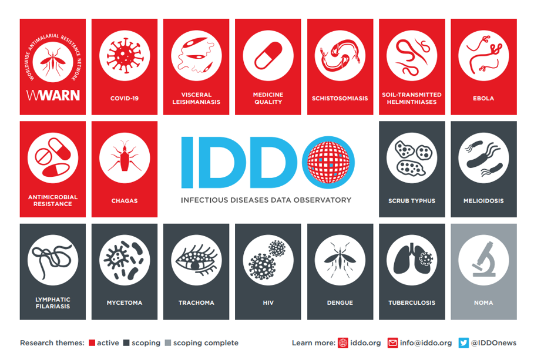

## Infectious Disease Data Observatory (IDDO) 

The Infectious Diseases Data Observatory (IDDO) is a scientifically independent, multi-disciplinary coalition of the global infectious disease and emerging infections communities. It provides the methods, governance and infrastructure to translate data into evidence that improves outcomes for patients worldwide. Currently, IDDO has eight active areas of research with many more already in development or being scoped for feasibility.

This GitHub hosts open-source code and packages which can be used for data cleaning, tranformation and analysis. 

### Contribution Guidelines
Our tools in this GitHub are made open source for you to use to assist in your research for the benefit of the global community, if you would like to add, improve or develop existing or new tools, we would be happy to collabroate with you.

We also welcome your interest in sharing your data through IDDO. If you are interested in [finding out more](https://www.iddo.org/data-sharing/contributing-data), please contact the team on info@iddo.org. 

By sharing your data through IDDO, you will help to:
- Promote and facilitate timely dissemination of research results;
- Identify gaps in knowledge that will inform the definition of research priorities going forward;
- Ensure that the results of research and innovation reach the communities and countries affected;
- Promote and facilitate the comparison and pooling of data to improve the power of research results;
- Develop accepted data standards and end-point measurements for clinical trials;
- Improve data collection practice.

### Resources
- [IDDO Website](https://www.iddo.org)
- [IDDO Wiki](https://wiki.iddo.org)
